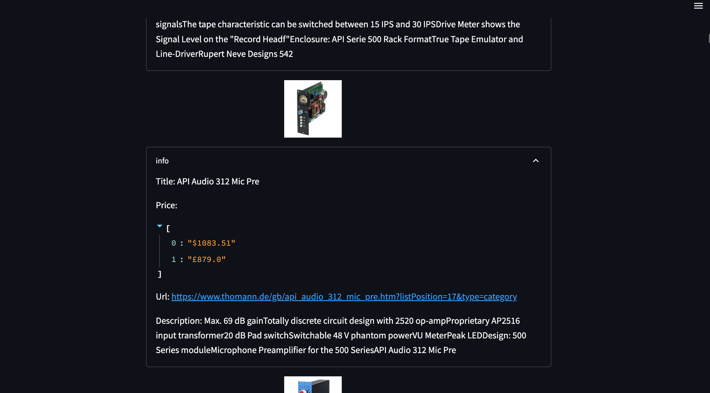

# 500 ENGINE

500 Engine is a vertical search engine which focuses on 500 series format analogue audio equipments. 





## Modules
500 Engine is made up of four Modules:

1. Database: **MongoDb** is employed for the storage of data.

2. Crawler: This module is responsible for crawling and scrapping data from two major online audio retailers: Sweetwater and Thomann. By utilising the package **Scrapy**, data for 500 series format audio equipments are scrapped, transformed and loaded into a **Docker** run **MongoDb** database. The crawler module can be found in the "search" directory.

3. Inverted index: This module stores a mapping of each unique **Term** found in the "discription" of each equipment scrapped, to the locations in which the **Term** occurs in the database and its **Term Frequency(TF)** in every location it occurs. This information is then stored in the **MongoDb** database as a new collection. The inverted index is the first step to implementing **Ranked Retrival** which is implemented in the final module. The Inverted index module can be found in the "index" directory.

4. Query processor: The query processor is responsible for processing user queries. By calculating the **Term Frequency(TF)/Inverse Document Frequency(IDF)** scores for each term in a query, the system is able to retrieve from the **MongoDb** database the most relevant documents based on the query. The Query processor module can be found in the "query_processor" directory.
## Tech Stack
- Python 
- MongoDb
- Docker
- AWS


## Run with Docker 

Clone the project

```bash
  git clone https://github.com/AfolabiAwonuga/500_engine.git
```

Go to the project directory

```bash
  cd 500_engine
```

Run with docker compose 
```bash
  docker compose up
```


## Demo

Insert gif or link to demo

